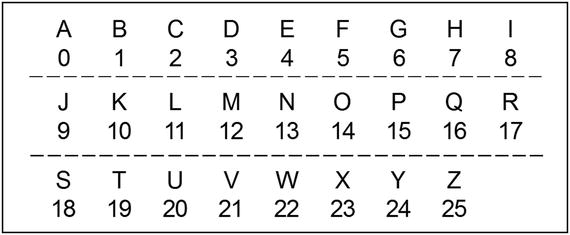
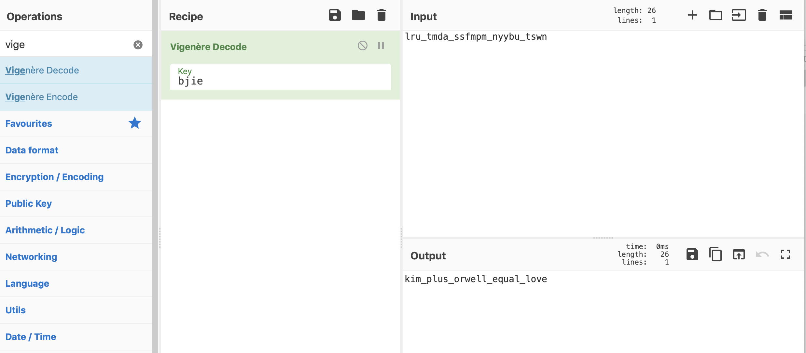

## north_korea = (Kim + CTF) * Orwell: Write-up

### Первое

Гуглим, пытаемся понять что же общего у Ким Чин Ына и Оруелла. Находим/вспоминаем одну из самых популярных книжек Оруелла "1984", видим что Ким Чин Ын родился в 1984, понимаем что это то, что мы искали.

### Второе
Пытаемся понять что за шифр мог использоватсья с ключом 1984. 

XOR? Видим, что изменились только символы алфавита, подчеркивания остались на месте -> шифр привязан к английскому алфавиту. 

Цезарь со сдвигом 1984? Можем попробовать сдвинуть все символы, а можем просто подумать и понять, что сдвиг в 1984 не особо имеет смысл, так-как максимальный уникальный сдвиг равен 26-ти, все остальные просто повторение предыдущих. 

Виженер? Как же тогда трактовать числовой ключ, если во всех интсрукциях и сервисах используются буквенные ключи? Читаем как работает шифр Виженера, понимаем что каждая буква в ключе используется как новое начало алфавита или сдвиг, ключ используется циклично, в нашем случаем:

	первый символ сдвигается на 1,
	второй - на 9;
	третий - на 8;
	четвертый - на 4;
	пятый - на 1;
	шестой - на 9 и т.д...

Для расшифровки текста, нужа сдвинуть все символы в обратную сторону, то есть:

	первый символ сдвигается на -1,
	второй - на -9 и т.д...

### Третье

Определив тип шифра и ключ, расшифровываем флаг с помошь скрипта/ручек/сервисов.
Например, используем [CyberChef](https://gchq.github.io/CyberChef/), выбираем Vigenere decode, видим, что ключ должен быть символьный, открываем пронумерованный английский алфавит и выбираем нужные нам символы.

Получаем строку 'bjie', вставляем ее в поле 'Key', в 'Input' вводим зашифрованный флаг, в 'Output' получаем расшифрованный.

Флаг: `surctf_kim_plus_orwell_equal_love`

