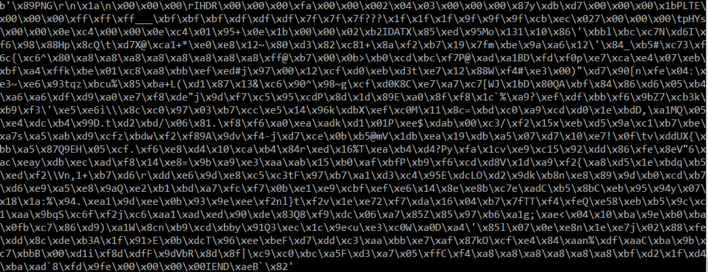

## Piece of Cake: Write-up

Не спрашивайте, почему этот таск так назван. Я всего лишь хотел подчеркнуть элементарность этого таска, назвав его в честь уровня сложности в Duke Nukem, но в итоге я понял, что это тонкий троллинг :D

Итак, файл настолько большой, что многие пекарни погибали, пытаясь открыть этот файл в блокноте. Поэтому, увидев, что наши товарищи теряют ~~боевых коней~~ компы, аккуратно открываем через терминал *(лучше, если у вас Linux или MacOS)*: `more out`

Пробежав по файлу, видим, что здесь все символы - обычные латинские буквы из таблицы ASCII, к тому же иногда видна закономерность и похоже на хеш или нечто подобное. Хм... Брут форсить хеш такой длины было бы безумством, поэтому предполагаем, может быть это Base64?

Так как такую штуковину не засунуть в онлайн-декодер, воспользуемся языками программирования. Я для удобства буду использовать Python.
Напишем несложный скрипт *(вы можете написать его по-другому, но принцип похожий)*:
```
#-*- coding: utf-8 -*-
from base64 import b64decode

f = open('out')
s = b64decode(f.read())
print(s.decode())
```
Программа зависла? Нет, просто процесс очень долгий.

И в итоге мы получаем... ещё Base64...
А теперь вспоминаем категорию таска.

Это **PPC**, а значит это таск, подобный таску [**Я не плачу - это просто лук**](https://github.com/surctf/surctf_2020_online/tree/master/tasks/onion_archive), а значит надо много раз декодировать Base64, пока на получим флаг.

Модифицируем наш скрипт:
```
#-*- coding: utf-8 -*-
import base64

f = open('out')
s = f.read()
while True:
    try:
        s = base64.b64decode(s)
    except base64.binascii.Error:
	break
try:
    print(s.decode())
except UnicodeError:
    print(s)

```

Видим следующий вывод:


Хм, теги png файла, значит это png файл, зашифрованный в base64. Можно поступить несколькими способами, лично я предпочёл бы снова модернизировать скрипт, например так:
```
#-*- coding: utf-8 -*-
import base64

s = input()

while True:
    try:
	s = base64.b64decode(s)
    except base64.binascii.Error:
	break

s = base64.b64encode(s)
f = open('out.html', 'w+')
f.write("".format(s.decode()))
```

Хорей! У нас есть картинка с флагом!


Флаг: `surctf_hand5_r_u531355`
